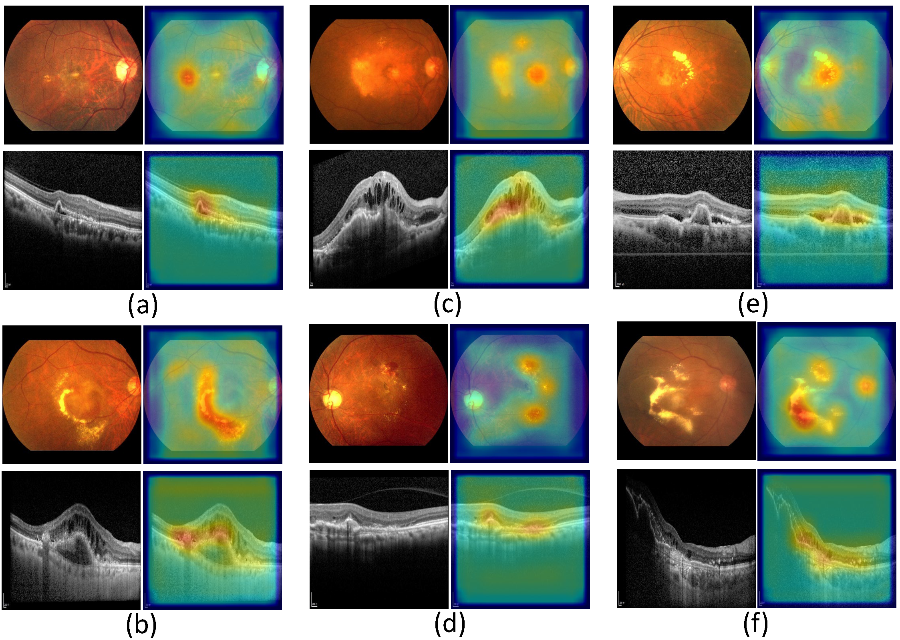

# Cross-modal Attention Network for Retinal Disease Classification (CRD-Net)

### Example Images from the Dataset

## Introduction
This repository contains the implementation of the paper **"Cross-modal attention network for retinal disease classification based on multi-modal images"** by Zirong Liu, Yan Hu, Zhongxi Qiu, Yanyan Niu, et al.

**Abstract:**
Multi-modal eye disease screening improves diagnostic accuracy by providing lesion information from different sources. However, existing multi-modal automatic diagnosis methods tend to focus on the specificity of modalities and ignore the spatial correlation of images. This paper proposes a novel cross-modal retinal disease diagnosis network (CRD-Net) that digs out the relevant features from modal images aided for multiple retinal disease diagnosis. Specifically, our model introduces a cross-modal attention (CMA) module to query and adaptively pay attention to the relevant features of the lesion in the different modal images. In addition, we also propose multiple loss functions to fuse features with modality correlation and train a multi-modal retinal image classification network to achieve a more accurate diagnosis. Experimental evaluation on three publicly available datasets shows that our CRD-Net outperforms existing single-modal and multi-modal methods, demonstrating its superior performance.

## Features
- Cross-Modal Attention (CMA) Module
- Multiple Loss Functions
- Evaluation on three publicly available datasets: MMC-AMD, APTOS-2021, and GAMMA

## Installation
Clone this repository:
\`\`\`bash
git clone https://github.com/ZirongLiu/CRD-Net.git
cd CRD-Net
\`\`\`

Install the required dependencies:
\`\`\`bash
pip install -r xxx.txt
\`\`\`

## Usage
### Training
To train the CRD-Net model, use the following command:
\`\`\`bash
python xxx.py --dataset [MMC-AMD/APTOS-2021/GAMMA] --epochs 150 --batch_size 8
\`\`\`

### Evaluation
To evaluate the model on the test set, use the following command:
\`\`\`bash
python xxx.py --dataset [MMC-AMD/APTOS-2021/GAMMA] --checkpoint_path path/to/checkpoint
\`\`\`

## Datasets
The datasets used in this study are publicly available:
1. **MMC-AMD**: [[Dataset Link](https://github.com/li-xirong/mmc-amd?tab=readme-ov-file)]
2. **APTOS-2021**: [[Dataset Link](https://tianchi.aliyun.com/competition/entrance/531929/introduction)]
3. **GAMMA**: [[Dataset Link](https://aistudio.baidu.com/competition/detail/119/0/introduction)]

Ensure you have the datasets downloaded and organized as described in the documentation before training or evaluating the model.

## Results
The CRD-Net model achieves state-of-the-art performance on the MMC-AMD, APTOS-2021, and GAMMA datasets. Detailed performance metrics and comparison with other methods are provided in the paper.

### Class Activation Map Visualization

## Citation
If you find this repository useful in your research, please cite the following paper:
\`\`\`bibtex
@article{liu2024crossmodal,
  title={Cross-modal attention network for retinal disease classification based on multi-modal images},
  author={Liu, Zirong and Hu, Yan and Qiu, Zhongxi and Niu, Yanyan and Zhou, Dan and Li, Xiaoling and Shen, Junyong and Jiang, Hongyang and Li, Heng and Liu, Jiang},
  journal={Biomedical Optics Express},
  volume={15},
  number={6},
  pages={3699--3713},
  year={2024},
  publisher={Optica Publishing Group}
}
\`\`\`

## License
This project is licensed under the MIT License - see the [LICENSE](LICENSE) file for details.

## Acknowledgments
This work was supported by the National Natural Science Foundation of China (82102189 and 82272086) and the Shenzhen Stable Support Plan Program (20220815111736001).

## Contact
For any questions or issues, please contact me.
